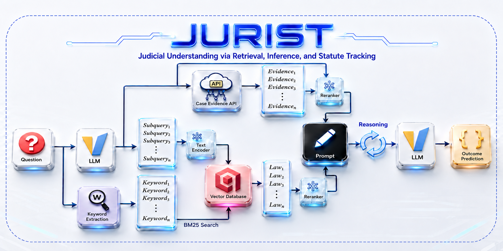
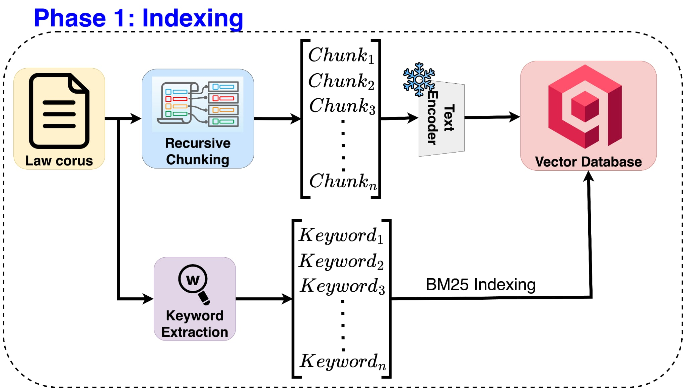
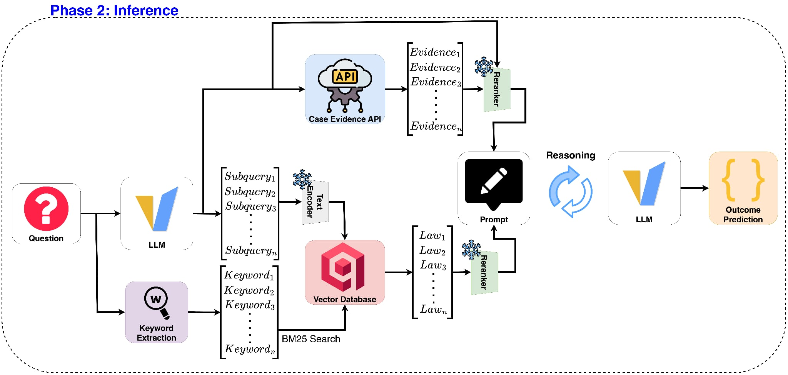

<p align="center">
  
</p>

---

## Introduction

**JURIST** is an agentic Retrieval-Augmented Generation (RAG) system built for the
**ALQAC 2026** legal judgment prediction task. Given a Vietnamese civil-case query,
the system must jointly produce three outputs:

1. **Outcome label** — a four-class verdict (`A_WIN`, `PARTIAL_A_WIN`, `PARTIAL_B_WIN`, `B_WIN`, where A is the plaintiff and B is the defendant), scored on a **binary winning-side** basis.
2. **Case evidence** — identifiers of relevant judgment segments, retrieved through a **rate-limited API** (one request every 5 seconds) and scored by **penalty-aware recall**.
3. **Law evidence** — the statutes the court applied, scored by **micro-F1**.

The whole pipeline is built exclusively from **open-weight models under 10B parameters**
(no proprietary APIs), as required by the competition. The generation model is
**Qwen3-4B-legal** (`VLSP2025-LegalSML/qwen3-4b-legal-pretrain`), self-hosted through
**vLLM** behind an OpenAI-compatible endpoint (served as `vietnamese-law` on
`http://localhost:8001/v1`).

### Three interchangeable pipelines

JURIST ships three retrieval strategies. All three consume the same data, call the same
vLLM model, and emit the same ALQAC submission format, so their outputs can be compared or
ensembled directly.

| Pipeline | Service | Retrieval core | Index store |
| --- | --- | --- | --- |
| **JURIST (main)** | `jurist.py` | Iterative hybrid dense+BM25 + cross-encoder rerank | Qdrant (`.cache/qdrant_*`) |
| **LegalGraph** | `legal_graph.py` | In-memory citation graph (`LegalGraphRAG`) + KNN + PageRank | pickle (`.cache/legal_graph_db.pkl`) |
| **DeepSearcher** | `deep_searcher.py` | Citation extraction + `DeepSearcher` vector retrieval | Milvus Lite (`.cache/deepsearcher_milvus.db`) |

- **`jurist.py`** — the reference pipeline: LLM query decomposition with a numeric
  anti-hallucination guard, iterative hybrid statute retrieval (`hiieu/halong_embedding` +
  BM25 over Qdrant) with an LLM coverage assessor, penalty-aware case-evidence collection,
  `AITeamVN/Vietnamese_Reranker` cross-encoder reranking, and self-consistency outcome
  prediction.
- **`legal_graph.py`** — reuses the in-memory graph database of
  [`LegalGraphRAG`](src/core/LegalGraphRAG) (`GraphDBManager` / `InMemoryGraphDB`): law
  articles become graph nodes with Halong embeddings, citation edges, `run_knn` similarity
  edges, PageRank and community annotations; retrieval seeds by vector search then expands
  along the graph.
- **`deep_searcher.py`** — extracts explicit statute citations from the retrieved judgment
  text, and falls back to the [`DeepSearcher`](src/core/deep-searcher) library (Halong
  embedding + Milvus Lite vector store) for semantic statute retrieval.


### Dataset

The competition data lives under `data/` in two splits:

- **Public test** (`ALQAC2026_public_test.json`) — 50 labeled first-instance civil cases with
  rich fields (facts, query, gold verdict, court verdict text, reasoning, cited statutes).
  Its law corpus (`corpus_law_pub.json`) holds 18 documents / 3,352 articles.
- **Private test** (`ALQAC_private_test.json`) — 60 unlabeled cases (case id + query); the
  real evaluation target. Its law corpus (`private_test_60_cases_extracted_corpus.json`) holds
  14 documents / 2,820 articles. **The launch scripts default to this private split.**

Case-evidence segments are **not** shipped in these files — they are retrieved live through
the rate-limited Case API.

### Architecture



<!-- <p align="center">
  
  
</p> -->

## Setup

### 1. Python environments

Two conda environments are used (the CUDA build must match the host driver — on a
driver-535 / CUDA-12.2 host, use cu12x wheels):

```bash
# Pipeline environment (embeddings, reranker, orchestration)
conda create -n nina python=3.10 -y
conda activate nina
pip install -r requirements.txt

# Serving environment (vLLM)
conda create -n vllm-legal python=3.12 -y
conda activate vllm-legal
pip install "vllm==0.19.1" --index-url https://download.pytorch.org/whl/cu128
```

The DeepSearcher pipeline needs a few extra packages in the `nina` env:

```bash
pip install "pymilvus>=2.5.8" milvus-lite "firecrawl-py>=2.5.3,<3" termcolor
```

### 2. Secrets

Create a `.env` file at the repository root with at least:

```
HF_TOKEN=<your huggingface token>
ALQAC_TOKEN=<case evidence API token>
```

`HF_TOKEN` downloads the gated models; `ALQAC_TOKEN` authenticates the Case Evidence API.

## Usage

Every pipeline runs in the same two phases and is launched with an `index` / `search`
subcommand. Model, data, and index-path knobs live at the top of each script in
`src/scripts/`.

### 1. Serve the model (once)

```bash
bash src/scripts/qwen_3_4b_legal.sh    # starts vLLM as `vietnamese-law` on port 8001
```

### 2. Index the law corpus, then run inference

```bash
# JURIST (main) — Qdrant hybrid retrieval
bash src/scripts/jurist.sh index
bash src/scripts/jurist.sh search

# LegalGraph — in-memory citation graph
bash src/scripts/legal_graph.sh index
bash src/scripts/legal_graph.sh search

# DeepSearcher — Milvus Lite vector retrieval
bash src/scripts/deep_searcher.sh index
bash src/scripts/deep_searcher.sh search
```

`index` builds the vector/graph store once per corpus (written under `.cache/`); `search`
loads that store and writes a submission to `submissions/`. Re-run `index` whenever the
corpus changes.

### 3. Stop the server

```bash
bash src/scripts/stop_qwen_3_4b_legal.sh
```

### Resume & checkpointing

All three `search` runs are **crash-safe and resumable**:

- The submission is written **after every case** (atomic replace), so a killed process never
  loses completed work.
- On restart, the pipeline **reads the existing output**, skips cases already done, and
  continues from where it stopped.
- If the output file is **already complete**, a new file is created with an incrementing
  suffix (`submission_*.json` → `submission_*-2.json` → `-3.json`, …) instead of overwriting.

## Fine-tuning

The models JURIST relies on are fine-tuned by the scripts in `src/core/`. The embedding
finetunes are configured through environment variables; the outcome classifier through CLI
flags.

### Retrieval embeddings

Both scripts read the corpus/test split from `ALQAC_CORPUS` / `ALQAC_TEST`, write to
`ALQAC_OUTPUT_DIR`, and push to the Hugging Face Hub.

```bash
conda activate nina

# Halong embedding -> leonpham1208/alqac_halong_embedding
#   ICT + Matryoshka (768/512/256/128/64), 100 epochs, batch 16
ALQAC_CORPUS=data/private_test_60_cases_extracted_corpus.json \
ALQAC_OUTPUT_DIR=./alqac_halong_embedding \
python src/core/halong_embedding_finetune.py

# vnlegal-lal embedding -> leonpham1208/alqac_vnlegal_lal
#   ANCE hard-negative mining (3 rounds), 2048 seq-len, LoRA merged to ALQAC_MERGED_DIR
ALQAC_CORPUS=data/private_test_60_cases_extracted_corpus.json \
ALQAC_OUTPUT_DIR=./alqac_vnlegal_lal \
ALQAC_MERGED_DIR=./alqac_vnlegal_lal_merged \
python src/core/vnlegal_lal_finetune.py
```

The resulting dense model is what `--dense-model hiieu/halong_embedding` (or the
`leonpham1208/alqac_halong_embedding` finetune) points at in the pipelines.

### Outcome classification (4-class verdict)

The verdict classifier predicts one of `A_WIN`, `PARTIAL_A_WIN`, `PARTIAL_B_WIN`, `B_WIN`
from the case query, via teacher→student knowledge distillation
(`Qualcomm-AI-Research/BamiBERT` → `leonpham1208/alqac_legal_outcome_cls`). It powers the
`ClassifierOutcomePredictor` used by `jurist.py` and `legal_graph.py`.

```bash
conda activate nina

# 1. Split labeled data into train/val/test (70/15/15)
python src/core/legal_outcome_split_data.py \
  --data data/ALQAC2026_public_test.json \
  --output-dir ./outcome_split --prefix outcome

# 2. Train teacher, then distill the student
python src/core/legal_outcome_classification_train.py \
  --train-data ./outcome_split/outcome_train.json \
  --valid-data ./outcome_split/outcome_valid.json \
  --test-data  ./outcome_split/outcome_test.json \
  --output-dir ./verdict_outputs

# 3. Predict from case_query only
python src/core/legal_outcome_classification_predict.py \
  --model-dir ./verdict_outputs/student \
  --data data/ALQAC_private_test.json \
  --output ./verdict_predictions.json
```

## Result

End-to-end scores per pipeline, alongside our public- and private-test leaderboard
submissions:

| Leaderboard    | Outcome Accuracy | Case Evidence | Micro Law Evidence F1 |
| -------------- | :--------------: | :-----------: | :-------------------: |
| Deep Searcher  |       0.62       |      0.23     |          0.67         |
| LegalGraphRAG  |       0.53       |     0.023     |          0.63         |
| Public (our)   |       1.0        |     0.043     |         0.704         |
| Private (our)  |    **0.4**       |    **0**      |        **1.3**        |`

## Reference

Full technical details are in [`docs/report.tex`](docs/report.tex). Related work:

1. Q. Zhang, S. Chen, Y. Bei, *et al.*, "A survey of graph retrieval-augmented generation for customized large language models," arXiv:2501.13958, 2025.
2. Z. Chen, Q. Zhang, Z. Xiang, *et al.*, "LegalGraphRAG: Multi-agent graph retrieval-augmented generation for reliable legal reasoning," arXiv:2605.28120, 2026.
3. M. Akarsu, R. K. Karaman, and C. Mierbach, "From BM25 to corrective RAG: Benchmarking retrieval strategies for text-and-table documents," arXiv:2604.01733, 2026.
4. K. Phan, X.-B. Le, and T. Quan, "SBV-LawGraph: A hybrid RAG approach integrating knowledge graph for the State Bank of Vietnam legal documents," in *Proc. ACIIDS*, 2026.

Competition: [ALQAC 2026](https://sites.google.com/view/alqac2026/home).
